---

title: "Designing a Resilient Multi-Tenant Platform on AWS ECS with Blue-Green Deployments"
description: "Learn how to design a resilient multi-tenant architecture on AWS ECS using cell-based isolation and blue-green deployments to minimize blast radius and improve reliability."
date: 2026-04-29
--------

# Designing a Resilient Multi-Tenant Platform on AWS ECS with Blue-Green Deployments

Modern SaaS platforms operate in a **multi-tenant model**, where a single system serves many customers.

> **How do you prevent one failure from affecting everyone?**

This guide walks through a **resilient architecture on AWS ECS**, combining:

* Cell-based multi-tenancy
* Blue-green deployments
* Tenant-aware routing
* Observability best practices

---

## 🚨 The Core Problem

Typical issues in multi-tenant ECS systems:

* A bad deployment impacts all tenants
* Noisy neighbors degrade performance
* Slow or risky rollbacks
* Lack of tenant-level observability

👉 The real goal is not scaling—it’s **failure isolation**.

---

## 🏗️ Reference Architecture

### High-Level Design

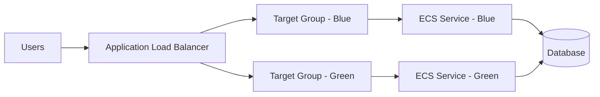

---

## 🧩 Cell-Based Multi-Tenancy

### Cell-Based Routing

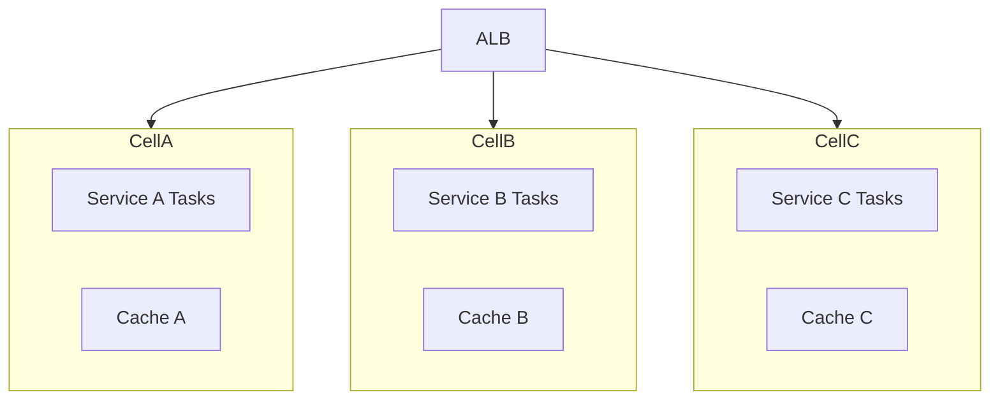

### Tenant Distribution Across Cells

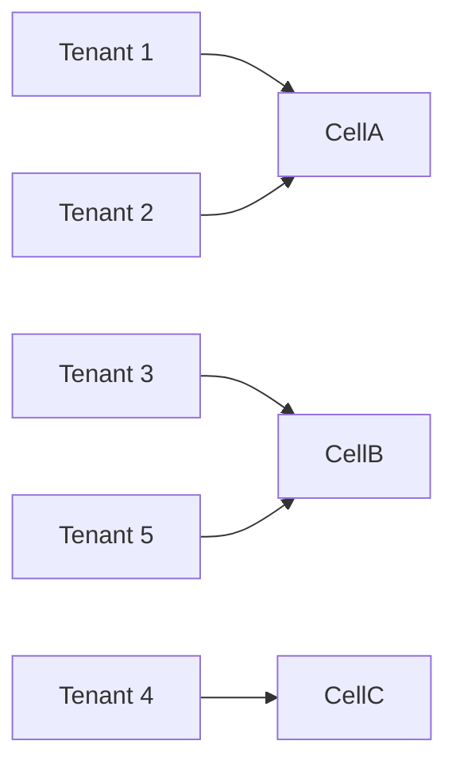

### Why Cell-Based Architecture?

* Limits blast radius
* Prevents noisy neighbor impact
* Enables safe, incremental deployments

Think of each cell as a mini independent platform.

---

## 🔁 Blue-Green Deployments on ECS

### Deployment Architecture

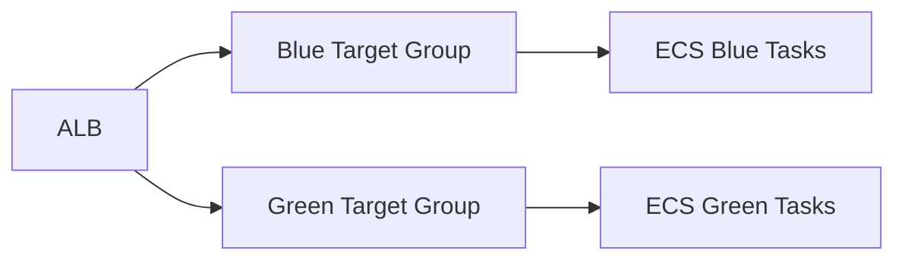

### Traffic Shifting Flow

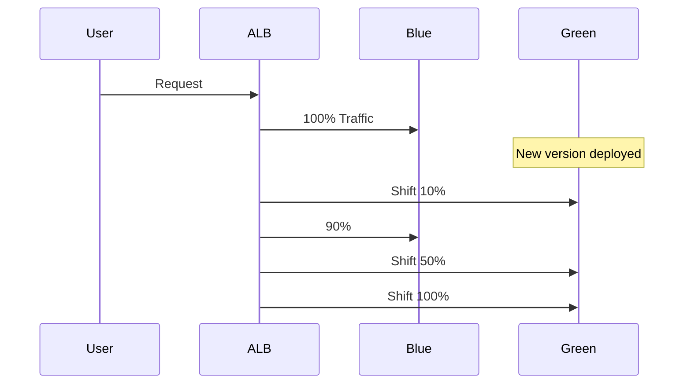

### Deployment Rollback Scenario

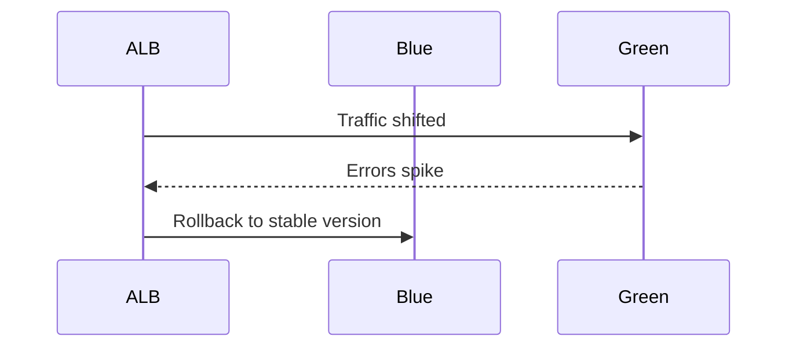

---

## ⚙️ Terraform Implementation

### ECS Service with CodeDeploy

```hcl
resource "aws_ecs_service" "app" {
  name            = "multi-tenant-service"
  cluster         = aws_ecs_cluster.main.id
  task_definition = aws_ecs_task_definition.app.arn

  deployment_controller {
    type = "CODE_DEPLOY"
  }

  load_balancer {
    target_group_arn = aws_lb_target_group.blue.arn
    container_name   = "app"
    container_port   = 80
  }

  desired_count = 3
}
```

### Target Groups

```hcl
resource "aws_lb_target_group" "blue" {
  name     = "blue-tg"
  port     = 80
  protocol = "HTTP"
  vpc_id   = aws_vpc.main.id
}

resource "aws_lb_target_group" "green" {
  name     = "green-tg"
  port     = 80
  protocol = "HTTP"
  vpc_id   = aws_vpc.main.id
}
```

### CodeDeploy Configuration

```hcl
resource "aws_codedeploy_app" "ecs" {
  name             = "ecs-app"
  compute_platform = "ECS"
}

resource "aws_codedeploy_deployment_group" "ecs" {
  app_name              = aws_codedeploy_app.ecs.name
  deployment_group_name = "ecs-deployment-group"
  service_role_arn      = aws_iam_role.codedeploy.arn

  deployment_style {
    deployment_type   = "BLUE_GREEN"
    deployment_option = "WITH_TRAFFIC_CONTROL"
  }

  ecs_service {
    cluster_name = aws_ecs_cluster.main.name
    service_name = aws_ecs_service.app.name
  }

  load_balancer_info {
    target_group_pair_info {
      target_group {
        name = aws_lb_target_group.blue.name
      }

      target_group {
        name = aws_lb_target_group.green.name
      }
    }
  }
}
```

---

## 🚦 Tenant-Aware Deployment Strategy

### Cell-by-Cell Rollout

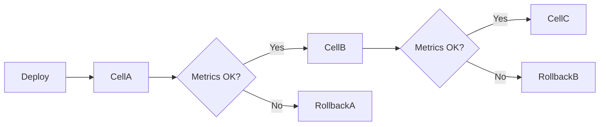

### Tenant Canary Strategy

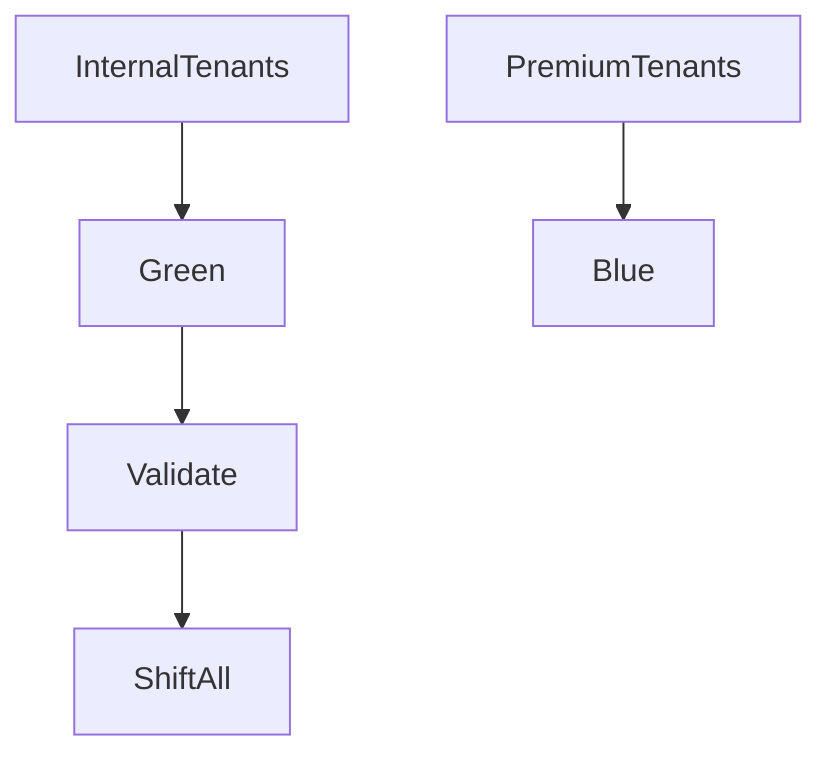

---

## 📊 Observability Architecture

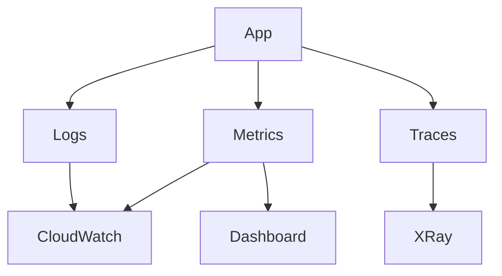

### Tenant-Aware Observability Flow

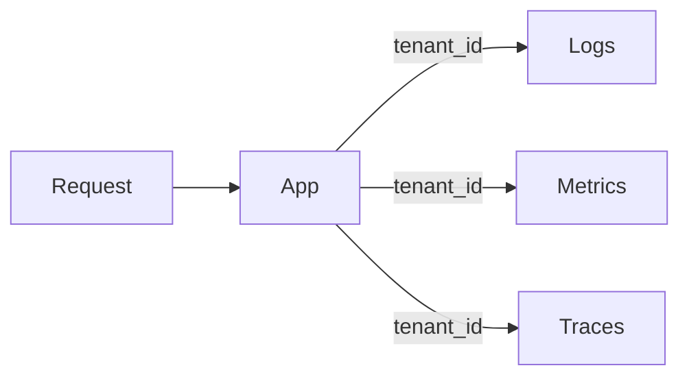

---

## 💥 Failure Scenarios

### Deployment Failure Isolation

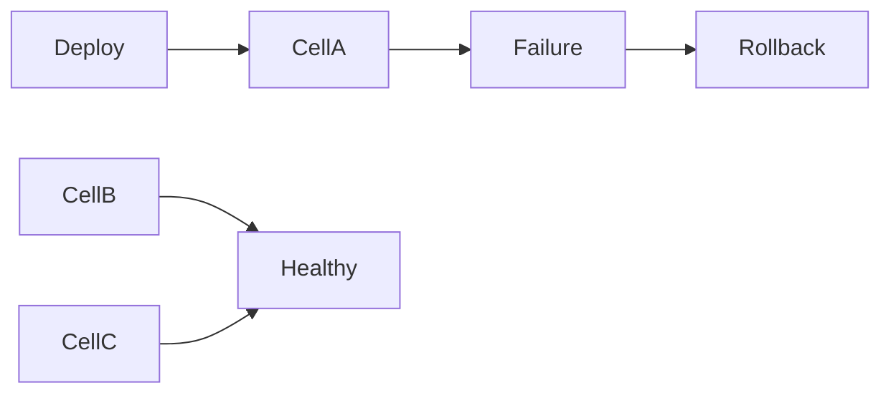

### Noisy Neighbor Scenario

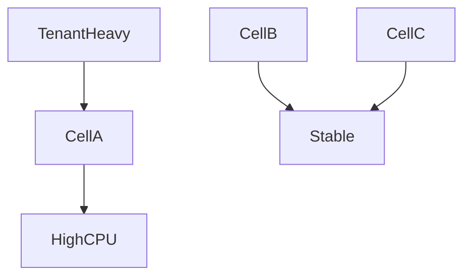

---

## 💰 Cost vs Resilience Trade-Off

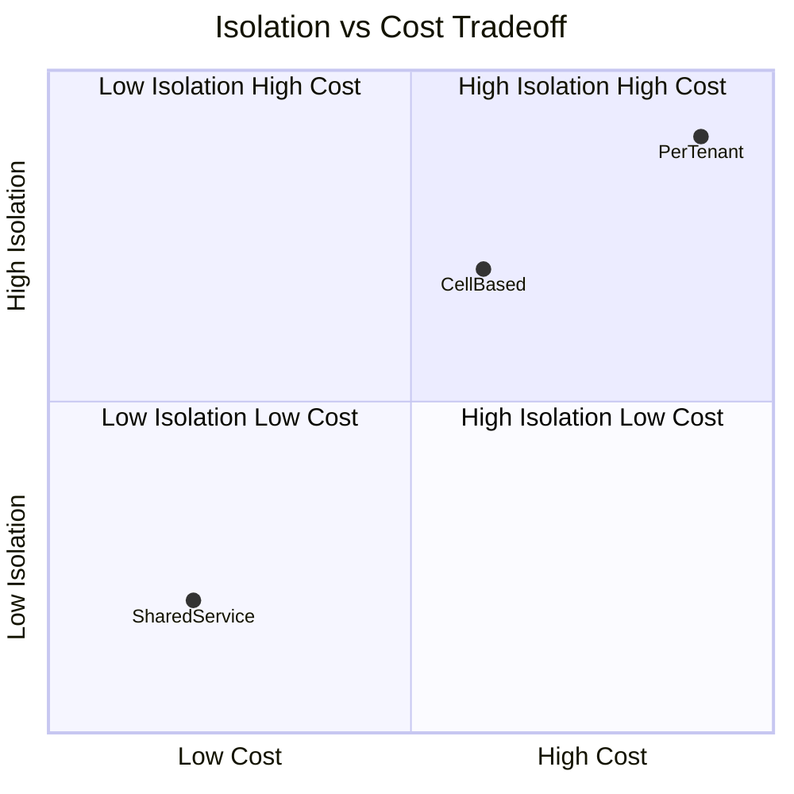

---

## ✅ Key Takeaways

* Avoid single shared services for all tenants
* Adopt cell-based architecture early
* Use blue-green deployments with traffic shifting
* Roll out changes per cell, not globally
* Invest in tenant-level observability
